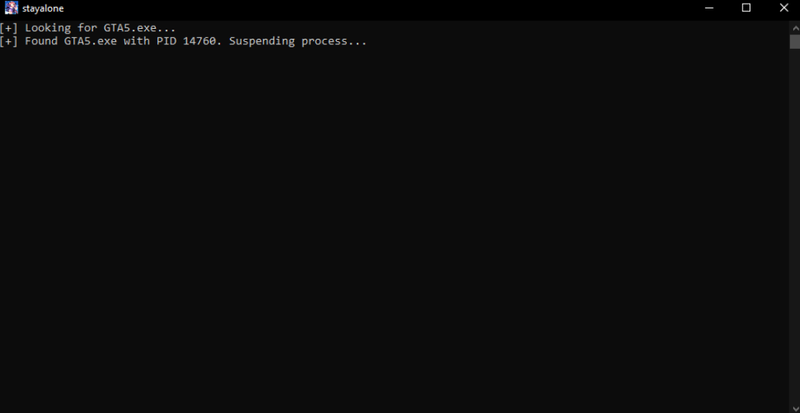

# 🕶️ StayAlone - Solo Lobby Tool for GTA Online

StayAlone is a lightweight tool that lets you instantly create a solo public lobby in GTA Online – no mods, no scripts, no stress.

## 🎥 Demo Video

> 🔗 Click the thumbnail above to see how it works in action!

---

## ✨ Features

- ⚡ Instantly puts you into a solo public session
- 🧠 Automates the suspend/resume trick (no more opening Task Manager!)
- 🪶 Ultra lightweight executable (~500KB)
- 💻 No installation or setup – just run and play
- 🔒 100% safe: doesn’t modify game files or use external cheats

---

## 🛠️ How It Works

The tool suspends the `GTA5.exe` process for 10 seconds, causing other players to time out. Then it automatically resumes the process — leaving you alone in a public lobby.

---

## 🚀 How to Use

1. Launch GTA Online and join a public lobby  
2. Run `stayalone.exe`  
3. Wait a few seconds... boom. You're alone 😎

> Optional: Pin it to your taskbar for quick access

---

## 💻 Requirements

- ✅ Windows 10 / 11  
- ✅ GTA V (Steam, Epic, or Rockstar version)  
- ❌ No admin rights required  
- ❌ No background services or dependencies

---

## 📸 Screenshots

*More coming soon...*

---

## 📦 Download

> 👉 [Releases Page](https://github.com/yourusername/stayalone/releases)

You can always grab the latest version from the Releases tab.

---

## 📬 Contributing & Issues

Found a bug or have an idea?  
Open an [issue](https://github.com/tot1337/stayalone/issues) or submit a [pull request](https://github.com/tot1337/stayalone/pulls).

---

## 📄 License

MIT License – do whatever you want, just don’t sell it as your own 😉

---

## ❤️ Support

If you like this project, consider giving it a ⭐ on GitHub or sharing the YouTube video. It really helps!
